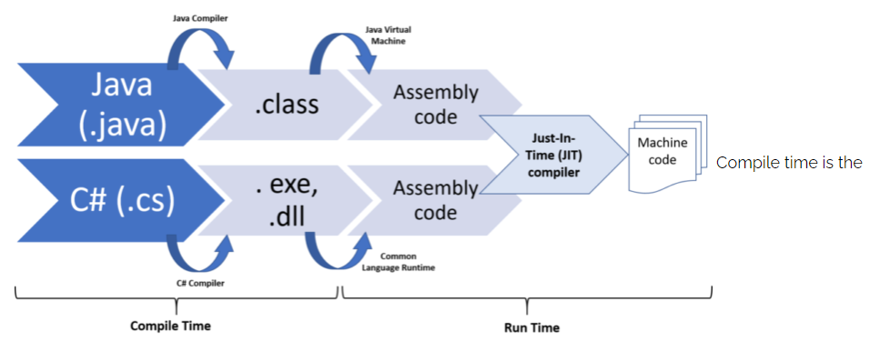

# Maven

## History of Java dependency tools:

### Apache Ant(xml base): 用於自動化Java應用程序的構建過程
In order to
1. run in different platform to make it portable
2. need something was born inside the java ecosystem to build java projects

At the moment Ant has two downsides
* can define what ever we want to customize every part, but also the problem that there is no pattern or convention for new developer to follow
* no inbuilt dependency relationship management support

### Maven(xml base) from 2002:
came up to solve problems of Ant's also add some features lessons learned

標準化，但Maven配置文件仍然會變得龐大而繁瑣，且較Ant沒彈性

### Gradle(Groovy base) from 2007: 結合了兩者的優點–Ant的靈活性和Maven的功能
Created by another group of developers who were not happy about how Maven not providing some features at the moment

---

## POM File

專有名詞
* properties
* dependencies: groupId, artifactId, version, classifier, type, scope, systemPath, optional
* plugin: goal

### Properties
properties section資料可以在POM檔任意地方被調用
```
<project>
  ...
  <properties>
    <maven.compiler.source>1.7</maven.compiler.source>
    <maven.compiler.target>1.7</maven.compiler.target>
    <!-- Following project.-properties are reserved for Maven in will become elements in a future POM definition. -->
    <!-- Don't start your own properties properties with project. -->
    <project.build.sourceEncoding>UTF-8</project.build.sourceEncoding> 
    <project.reporting.outputEncoding>UTF-8</project.reporting.outputEncoding>
  </properties>
  ...
</project>
```

### dependencies, groupId, artifactId, version, classifier, type, scope, systemPath, optional
```
<dependencies>
    <dependency>
      <groupId>junit</groupId>
      <artifactId>junit</artifactId>
      <version>4.12</version>
      <type>jar</type>
      <scope>test</scope>
      <optional>true</optional>
    </dependency>
    ...
  </dependencies>
```
#### dependency
1. can define one in `<dependencies>` section, which known as **direct dependencies**
2. dependencies brought by direct dependencies are known as **transitive dependencies**
3. maven resolves dependencies by locality
    1. direct dependencies found the last wins
    2. transitive dependencies found the first wins
4. `<dependencyManagement>` section can specify dependency version, doesn't matter if it's a direct or transitive
   dependency
5. We can list all dependencies including transitive dependencies in the project using: ```mvn dependency:tree```
   command.

#### groupId, artifactId, version (Maven Coordinates)
* groupId, artifactId: directly the corresponding coordinates of the dependency
* version: a dependency version requirement specification, that is used to compute the dependency's effective version.

#### classifier
The classifier distinguishes artifacts that were built from the same POM but differ in content.

#### type
filename of the dependency, defaults to `jar`, [see the whole list here](https://maven.apache.org/ref/3.8.4/maven-core/artifact-handlers.html)

#### scope
transitivity of a dependency.
* compile - 此為預設值，表示此jar是所有階段需要的。 部署時將一起被打包到jar/war裡面。
    * this is the **default scope**, used if none is specified. Compile dependencies are available in all class paths. Furthermore, those dependencies are propagated to dependent projects.
* provided - 當運行時，表示此jar檔期望由JDK、Tomcat及jboss等來提供。如 servlet.jar、jsp-api.jar 等。部署時將不會打包到jar/war裡面。
    * this is much like `compile`, but indicates you **expect the JDK or a container to provide it at runtime**. It is only available on the compilation and test classpath, and is not transitive.
* system - 表示此jar檔由系統提供。跟provided 相似，這是以外部JAR檔的形式提供。而在maven repository 是無法找到它的。需指定位置，配合 systemPath 來使用。
    * this scope is similar to `provided` except that you have to provide the JAR which contains it explicitly. The artifact is always available and is not looked up in a repository.
* runtime - 表示此jar檔只有在運行時，才需要使用。如jdbc jar等。
    * this scope indicates that **the dependency is not required for compilation, but is for execution**. It is in the runtime and test class paths, but not the compilation class path.
* test - 表示此jar檔只有在測試時，才需要使用。如 junit jar 等。部署時將不會打包到jar/war裡面。
    * this scope indicates that the dependency is not required for normal use of the application, and is **only available for the test compilation and execution phases**. It is not transitive.



#### systemPath
當Scope設定為`system`才需要這個欄位
Since it is assumed that system scope dependencies are installed a priori, Maven does not check the repositories for the project, but instead checks to ensure that the file exists. If not, Maven fails the build and suggests that you download and install it manually.

#### optional
Marks a dependency optional when this project itself is a dependency.
Note: another way is to define Exclusion.

---

## Lifecycle Phases
* Clean
* Default
* Site

#### Clean
| Phase      | Description                                                   |
|------------|---------------------------------------------------------------|
| pre-clean	 | execute processes needed prior to the actual project cleaning | 
| clean      | 	remove all files generated by the previous build             | 
| post-clean | 	execute processes needed to finalize the project cleaning    | 

#### Default
| Phase                    | Description                                                                                                                                              |
|--------------------------|----------------------------------------------------------------------------------------------------------------------------------------------------------|
| validate	                | validate the project is correct and all necessary information is available.                                                                              |
| initialize	              | initialize build state, e.g. set properties or create directories.                                                                                       |
| generate-sources         | 	generate any source code for inclusion in compilation.                                                                                                  |
| process-sources	         | process the source code, for example to filter any values.                                                                                               |
| generate-resources	      | generate resources for inclusion in the package.                                                                                                         |
| process-resources	       | copy and process the resources into the destination directory, ready for packaging.                                                                      |
| compile	                 | compile the source code of the project.                                                                                                                  |
| process-classes          | 	post-process the generated files from compilation, for example to do bytecode enhancement on Java classes.                                              |
| generate-test-sources    | 	generate any test source code for inclusion in compilation.                                                                                             |
| process-test-sources	    | process the test source code, for example to filter any values.                                                                                          |
| generate-test-resources	 | create resources for testing.                                                                                                                            |
| process-test-resources	  | copy and process the resources into the test destination directory.                                                                                      |
| test-compile             | 	compile the test source code into the test destination directory                                                                                        |
| process-test-classes     | 	post-process the generated files from test compilation, for example to do bytecode enhancement on Java classes.                                         |
| test                     | 	run tests using a suitable unit testing framework. These tests should not require the code be packaged or deployed.                                     |
| prepare-package          | 	perform any operations necessary to prepare a package before the actual packaging. This often results in an unpacked, processed version of the package. |
| package                  | 	take the compiled code and package it in its distributable format, such as a JAR.                                                                       |
| pre-integration-test     | 	perform actions required before integration tests are executed. This may involve things such as setting up the required environment.                    |
| integration-test         | 	process and deploy the package if necessary into an environment where integration tests can be run.                                                     |
| post-integration-test    | 	perform actions required after integration tests have been executed. This may including cleaning up the environment.                                    |
| verify                   | 	run any checks to verify the package is valid and meets quality criteria.                                                                               |
| install                  | 	install the package into the local repository, for use as a dependency in other projects locally.                                                       |
| deploy                   | 	done in an integration or release environment, copies the final package to the remote repository for sharing with other developers and projects.        |

#### Site
| Phase        | Description                                                                                  |
|--------------|----------------------------------------------------------------------------------------------|
| pre-site     | 	execute processes needed prior to the actual project site generation                        |
| site	        | generate the project's site documentation                                                    |
| post-site	   | execute processes needed to finalize the site generation, and to prepare for site deployment |
| site-deploy	 | deploy the generated site documentation to the specified web server                          |

## Plugin
represents a specific task (finer than a build phase) which contributes to the building and managing of a project.
```
...
 <plugin>
   <groupId>org.codehaus.modello</groupId>
   <artifactId>modello-maven-plugin</artifactId>
   <version>1.8.1</version>
   <executions>
     <execution>
       <configuration>
         <models>
           <model>src/main/mdo/maven.mdo</model>
         </models>
         <version>4.0.0</version>
       </configuration>
       <goals>
         <goal>java</goal>
       </goals>
     </execution>
   </executions>
 </plugin>
...
```

1. any plugin may be applied using the long notation `G:A:V:goal` (groupId, artifactId, version, goal)
    1. ex: `mvn com.github.ekryd.echo-maven-plugin:echo-maven-plugin:1.2.0:echo -Decho.message="hello world"`
2. may be bound to zero or more build phases, which means we don't need to define any plugin in pom file
3. would use the latest release for the plugins
4. once plugin is downloaded, it runs with that local one without downloading again
5. Maven本身是個plugin的執行框架(為一種artifact)，所有建構階段的工作實際上是交由plugin的goal處理，而Maven僅是安排每個phase工作的執行順序
6. 一個plugin中會可能包含多個goal；也就是說plugin是goal的容器。

### Useful Plugins

#### [Maven Surefire Plugin](https://maven.apache.org/plugins-archives/maven-surefire-plugin-2.12.4/)
* The Surefire Plugin is used during the test phase of the build lifecycle to execute the unit tests of an application.

##### Running a Single Test
```
mvn -Dtest=TestCircle test
mvn -Dtest=TestCi*le test
mvn -Dtest=TestSquare,TestCi*le test
```
##### Running a set of methods in a Single Test Class
```
mvn -Dtest=TestCircle#mytest test
mvn -Dtest=TestCircle#test* test
mvn -Dtest=TestCircle#testOne+testTwo test
```

##### [log4j + mvn test](https://logging.apache.org/log4j/2.x/manual/configuration.html)

#### Maven Failsafe Plugin
* The Failsafe Plugin is designed to run integration tests while the Surefire Plugin is designed to run unit tests.
* It implies that when it fails, it does so in a safe way.

### Plugin and Dependency:

| plugin                                                                                                           | dependency                                                                                                                       |
|------------------------------------------------------------------------------------------------------------------|----------------------------------------------------------------------------------------------------------------------------------|
| 是一個可以執行任務的 Jar 檔                                                                                                 | 是一個提供class files執行任務的 Jar 檔                                                                                                      |
| A. dependency引入的東西是程式碼編譯/運行時所需要的東西，專案打包後這些東西基本都在。如：JSON工具包GSON（com.google.code.gson），不僅開發時要用，專案運行時也要用，就需要打包進項目中； | B. plugin引入的東西，作為開發/編譯/打包時的一種輔助工具，一般不會打包進專案中。如：使用 maven-source-plugin 將API包的源始碼一起打包，方便發布至Maven repository，而這個plugin不會在打包後的專案中出現。 |

### [Lifecycle Bindings](http://maven.apache.org/guides/introduction/introduction-to-the-lifecycle.html#built-in-lifecycle-bindings)
Maven的packaging提供了預設的phase與plugin goal的綁定關係

* 如果在pom.xml沒有指定packaging，則Maven預設會使用jar packaging。
* 如果一個phase沒有綁定任何goal則會直接跳過該phase。
* 至於在pom.xml另外設定的plugin的goal會與packaging的goal一起綁定phase。如果一個phase綁定了多個goal，則執行到該phase時，會先執行packaging所綁定的goal，然後才執行pom.xml中綁定的plugin goal。

## .m2 folder
Maven下載包括jar等檔案都會存在本地的.m2資料夾，預設為以下：
* Unix/Mac OS X – ~/.m2
* Windows – C:\Users\\{your-username}\\.m2

.m2設定檔可以在下面路徑找到
```
{M2_HOME}\conf\setting.xml
```
or
```
C:\Users\{your-username}\.m2
```
下載後的local檔案會在以下的.m2路徑
```
{M2_HOME}\repository
```

---

## Traits of Maven

1. Maven's default java version is Java 5
2. don't do `mvn clean install`, use `mvn verify`
    1. install is only for local dependency problem needed to be solved
    2. life cycle of mvn build tells us, unless you need to pull repository to local, just do the previous step, verify
    3. `clean` is diminishing incremental compilation.
3. `mvn -am -pl`
    1. `-pl` to only execute subset of your project
    2. `-am` to execute subset specified with its prerequisite dependencies
    3. e.g. project2 dependent on project1, project3 dependent on project2, and we can
       use `mvn **-am** -pl :project3 build` to only build with the updated dependencies

---

## Further Readings
* [What I Wish I Knew About Maven Years Ago](https://www.youtube.com/watch?v=FV2N86kkkHs&feature=youtu.be)

## References
* [Apache Maven Project](https://maven.apache.org/)
* [Ant vs Maven vs Gradle](https://www.twblogs.net/a/5d0a0c3bbd9eee1ede03ed06)
* [Introduction to the Build Lifecycle](https://maven.apache.org/guides/introduction/introduction-to-the-lifecycle.html)
* [Maven Dependency Scope](http://pclevin.blogspot.com/2015/02/maven-dependency-scope.html)